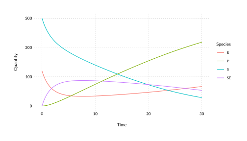

<!-- README.md is generated from README.Rmd. Please edit that file -->

# bondr

<!-- badges: start -->

[](https://github.com/dbarrows/bondr/actions)
[](https://www.tidyverse.org/lifecycle/#maturing)
<!-- badges: end -->

Provides utilities and classes for working with reaction networks in R.

## Installation

You can install the development version from
[GitHub](https://github.com/) with:

``` r
devtools::install_github('dbarrows/bondr')
```

## Creating networks

You write systems of reactions using a natural syntax, and bondr will
parse it and turn it into an S3 object.

``` r
library(bondr)

(synthesis <- network('A + B -> C, 2.4e-5'))
#> # Reaction network: 1 reaction x 3 species
#>     Reactants    Products     Rate
#> 1       A + B -> C         2.4e-05
```

### Sources / sinks

You can specify sources / sinks using `0` as the species name.

``` r
network('0 -> A, 4')
#> # Reaction network: 1 reaction x 1 species
#>     Reactants    Products  Rate
#> 1           0 -> A            4
```

### Multiple reactions

Reactions can be entered on new lines.

``` r
network_string <- '
    S + E -> SE, 1.66e-3
    SE -> E + P, 1e-1
'
network(network_string)
#> # Reaction network: 2 reactions x 4 species
#>     Reactants    Products     Rate
#> 1       S + E -> SE        0.00166
#> 2          SE -> E + P         0.1
```

### Bidirectional reactions

You can use `<->` to indicate bidirectional reactions, with an
additional rate specified at the end of the line.

``` r
network('A <-> B, 1e-1, 2.2')
#> # Reaction network: 2 reactions x 2 species
#>     Reactants    Products  Rate
#> 1           A -> B          0.1
#> 2           B -> A          2.2
```

### Species orders

Prefixing a species name with a number will be interpreted as a reaction
coefficient.

``` r
network <- network('2A -> B, 1e-1')
str(network$reactions[[1]])
#> List of 3
#>  $ reactants:List of 1
#>   ..$ :List of 2
#>   .. ..$ name : chr "A"
#>   .. ..$ order: num 2
#>   .. ..- attr(*, "class")= chr "species"
#>  $ products :List of 1
#>   ..$ :List of 2
#>   .. ..$ name : chr "B"
#>   .. ..$ order: num 1
#>   .. ..- attr(*, "class")= chr "species"
#>  $ rate     : num 0.1
#>  - attr(*, "class")= chr "reaction"
```

## Using networks

### Propensity functions

You can generate the propensity functions for a reaction network.

``` r
network <- network('
         A -> B, 2.5
    2B + C -> A, 4e-2
')
(props <- propensities(network))
#> [[1]]
#> function (x) 
#> {
#>     2.5 * x[1]
#> }
#> <environment: 0x7ff0e0740610>
#> 
#> [[2]]
#> function (x) 
#> {
#>     0.04 * x[2] * (x[2] - 1)/2 * x[3]
#> }
#> <environment: 0x7ff0e07b5a78>
```

Note that dimerisations and multiple reactants are handled properly.

Propensity functions take a state vector of species quantities, ordered
according to the output of the `species` function.

``` r
species(network)
#> [1] "A" "B" "C"
state <- c(2, 5, 4) # Corresponds to A, B, C
(props[[1]](state))
#> [1] 5
(props[[2]](state))
#> [1] 1.6
```

### Stoichiometric matrix

A matrix that conveys how the system updates when reactions fire. The
columns correspond to reactions, and the rows to species.

``` r
mm_string <- network_string_examples('mm')
cat(mm_string)
#> 
#> S + E <-> SE,    1.66e-3, 1e-4
#>    SE  -> E + P, 1e-1
(network <- network(mm_string))
#> # Reaction network: 3 reactions x 4 species
#>     Reactants    Products     Rate
#> 1       S + E -> SE        0.00166
#> 2          SE -> S + E       1e-04
#> 3          SE -> E + P         0.1
stmat(network)
#>      [,1] [,2] [,3]
#> [1,]   -1    1    0
#> [2,]   -1    1    1
#> [3,]    1   -1   -1
#> [4,]    0    0    1
```

## Solving

`bondr` also provides a function `deriv` to get a derivative function
compatible with the `deSolve` R package, which contains a number of
numerical integrators.

### Using `deSolve`

Obtaining a deterministic solution to a system as in the Reaction Rate
Equation can be done as follows.

``` r
library(deSolve)

y <- c(S = 300, E = 120, SE = 0, P = 0)
times <- seq(0, 30, length.out = 100)
func <- deriv(network)

sol <- ode(y, times, func)
head(sol)
#>           time        S         E       SE         P
#> [1,] 0.0000000 300.0000 120.00000  0.00000 0.0000000
#> [2,] 0.3030303 283.6196 103.87346 16.12654 0.2538657
#> [3,] 0.6060606 270.0844  91.02873 28.97127 0.9443315
#> [4,] 0.9090909 258.6933  80.67784 39.32216 1.9845847
#> [5,] 1.2121212 248.9504  72.25847 47.74153 3.3080324
#> [6,] 1.5151515 240.4961  65.35880 54.64120 4.8626940
```

### Plotting

You can then plot the solution using a few `tidyverse` functions fairly
easily.

``` r
library(tidyverse)
library(wplot)

sol %>%
    data.frame() %>%
    rename(Time = time) %>%
    pivot_longer(species(network), names_to = 'Species', values_to = 'Quantity') %>%
    ggplot(aes(x = Time, y = Quantity, colour = Species)) +
        geom_line() +
        theme_wc()
```


